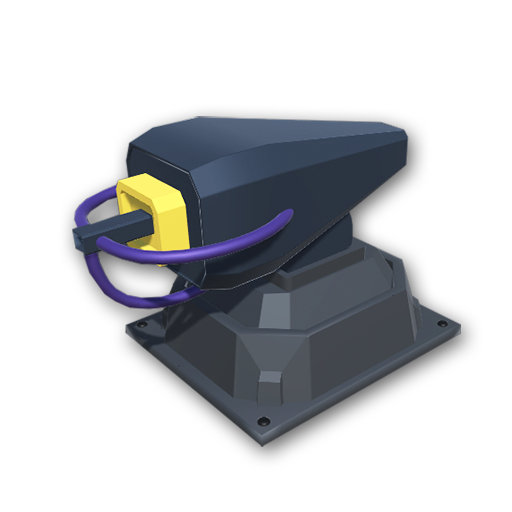
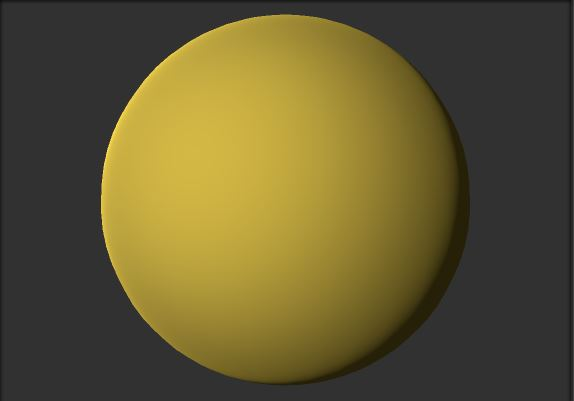

# Monster Tower Defense Game

Monster Tower Defense adalah permainan yang tujuan utamanya adalah untuk mempertahankan wilayah agar tidak di lewati musuh yang dapat dicapai dengan menempatkan *turret* di sepanjang jalan. Permainan ini memiliki beberapa gelombang, tiap gelombangnya musuh akan bertambah kuat dan di akhir gelombang *player* harus memusnahkan bos moster. Untuk menghambat musuh, *turret* dapat di-*upgrade* dengan uang hasil membunuh musuh.

# Developer
| Designer | Artist | Programer |
| ------ | ------ | ------ | 
| Muhamad Guntur (G64170020) | Rizha (G64170003) | Muhammad Nur Hidayat (G64170079) |

# Screenshot

# Gameplay
1. Tower musuh akan men-deploy monster yang akan terus berjalan menuju tower kita
2. Tersedia pilihan turret yang bisa player bangun untuk membunuh monster
3. Membangun turret ada Cost yang harus dikeluarkan 
4. Money akan berkurang saat membangun turret
5. Money akan bertambah saat membunuh monster
6. Player akan menang saat semua monster telah mati
7. Player akan kalah saat monster berhasil lewat dan sampai ke tower player.

# Weapons
\
**Standard Turret**\
Cost : 100\
Damage : 50\
Range : 15

**Upgraded Standard Turret**\
Upgrade Cost : 60\
Damage : 70\
Range : 15\
\
**Missile Launcher**\
Cost : 250\
Damage : 60\
Range : 30

**Upgraded Missile Launcher**\
Upgrade Cost : 150\
Damage : 60\
Range : 40\
\
**Laser Beamer**\
Cost : 350\
Damage : 30 (overtime)\
Range : 20

**Upgraded Laser Beam**\
Upgrade Cost : 250\
Damage : 40\
Range : 30\

# Enemies
\
**Enemy_Simple**\
HP : 120\
Speed : 10\
Worth : 50

\
**Enemy_Fast**\
HP : 20\
Speed : 40\
Worth : 25

\
**Enemy_Tough**\
HP : 350\
Speed : 7\
Worth : 140

\
**Dragon**\
HP : 2000\
Speed : 5\
Worth : 500

# Development
| Game Engine | Assets |
| ----------- | ------ |
| Unity Ver. 2018.2.1f1 | *Unity Asset Store* |
| | *free3d.com* |
